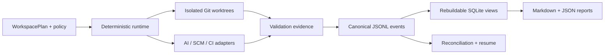

<!-- generated-by: gsd-doc-writer -->

<p align="center">
  <picture>
    <source media="(prefers-color-scheme: dark)" srcset="docs/assets/brand/omnibranch-logo-dark.svg">
    <source media="(prefers-color-scheme: light)" srcset="docs/assets/brand/omnibranch-logo-light.svg">
    
  </picture>
</p>

<p align="center">
  Deterministic, local-first orchestration for bounded AI development across Git branches and worktrees.
</p>

<p align="center">
  <a href="https://nodejs.org/"></a>
  <a href="LICENSE"></a>
  <a href=".github/workflows/ci.yml"></a>
</p>

OmniBranch helps maintainers coordinate multiple AI workers without making prompts or model output the source of truth. The CLI owns scheduling, Git isolation, path ownership, policy decisions, validation evidence, recovery, and reporting. Workers receive bounded assignments and operate in disposable worktrees.

> **Release status:** `0.2.0` is implemented and release-verified in this repository, but the npm package has not been published. Use the checked-in tarball or build from source until an authorized registry release occurs.

## Why OmniBranch?

- **Parallel without collisions.** Each task receives an isolated worktree and explicit repository-relative ownership.
- **Deterministic control plane.** A documented state machine, DAG scheduler, leases, policy engine, and validation graph decide what happens next.
- **Recoverable by design.** Canonical JSONL events, rebuildable SQLite projections, transaction journals, and reconciliation make interrupted work resumable.
- **Provider-neutral.** One Agent Skill installs to Codex, Claude Code, OpenCode, Antigravity, or the generic `.agents/skills` convention.
- **Safe defaults.** Destructive Git operations are omitted, external writes require approval, unavailable required checks do not pass, and secrets are redacted.
- **Local first.** Core orchestration, mock execution, tests, reports, and installer workflows work without a hosted OmniBranch service.

## Install

### Try the verified local package

```sh
npm install --global ./artifacts/omnibranch-0.2.0.tgz
omnibranch --version
```

### After an authorized npm release

```sh
npm install --global omnibranch@0.2.0
omnibranch skill install --target auto --scope user
```

To install the skill without keeping the CLI globally:

```sh
npx omnibranch@0.2.0 skill install --target auto --scope user
```

See the [installation guide](docs/INSTALLATION.md) for source builds, project scope, provider paths, upgrades, and uninstall behavior.

## Five-minute skill setup

1. Inspect the supported destinations without changing anything:

   ```sh
   omnibranch skill targets --scope user --json
   ```

2. Preview the exact operation:

   ```sh
   omnibranch skill plan --target auto --scope user --dry-run --json
   ```

3. Install detected providers and verify the result:

   ```sh
   omnibranch skill install --target auto --scope user --json
   omnibranch skill doctor --scope user --json
   ```

`auto` falls back to the generic Agent Skills destination when no provider is detected. Installations are copied, hash-verified, receipt-managed, and recoverable; OmniBranch does not create skill symlinks.

## Supported skill targets

| Provider             | User scope                                                      | Project scope                 | Verification                            |
| -------------------- | --------------------------------------------------------------- | ----------------------------- | --------------------------------------- |
| Codex                | `$CODEX_HOME/skills/omnibranch` or `~/.codex/skills/omnibranch` | Use generic target            | Local contract                          |
| Claude Code          | `~/.claude/skills/omnibranch`                                   | `.claude/skills/omnibranch`   | Fixture contract                        |
| OpenCode             | `~/.config/opencode/skills/omnibranch`                          | `.opencode/skills/omnibranch` | Fixture contract                        |
| Antigravity          | `~/.gemini/config/skills/omnibranch`                            | `.agents/skills/omnibranch`   | Fixture contract; IDE handoff is guided |
| Generic Agent Skills | `~/.agents/skills/omnibranch`                                   | `.agents/skills/omnibranch`   | Full local lifecycle                    |

Project-scoped Codex discovery is intentionally unsupported. Use `--target agents --scope project` instead.

## Run a local campaign

Build from source, then initialize a repository-local plan:

```sh
corepack enable
corepack prepare pnpm@11.11.0 --activate
pnpm install --frozen-lockfile
pnpm build
pnpm omnibranch -- doctor --json
pnpm omnibranch -- init --json
pnpm omnibranch -- config validate --json
```

Exercise the offline mock vertical slice:

```sh
pnpm omnibranch -- campaign create --name example --json
pnpm omnibranch -- plan --campaign <campaign-id> --dry-run --json
pnpm omnibranch -- run --campaign <campaign-id> --json
pnpm omnibranch -- status --campaign <campaign-id> --json
pnpm omnibranch -- review --campaign <campaign-id> --json
pnpm omnibranch -- report --campaign <campaign-id> --json
```

Commands emit a stable envelope containing `ok`, `command`, `data`, `warnings`, `policyDecisions`, `dryRun`, and structured error details.

## How it works



AI adapters follow a shared `probe → prepare → launch → supervise → collect → finalize` lifecycle. Missing versions, cancellation, or policy controls downgrade autonomy instead of being guessed.

## Safety model

OmniBranch treats repository content, provider output, paths, environment variables, and remote responses as untrusted data.

- Git commands use executable-plus-argument arrays, never interpolated shell commands.
- Force push, hard reset, broad clean, and unsafe branch deletion are outside the supported backend.
- Required validation gates pass only with explicit `pass` evidence.
- Mutations support dry-run planning and policy evidence.
- Modified or unmanaged skill destinations are refused unless the operator supplies the relevant explicit flag.
- Credentials must not enter events, reports, prompts, snapshots, or logs.

Read [Security and policy](docs/05_SECURITY_AND_POLICY.md) and [SECURITY.md](SECURITY.md) before using real credentials or remote writes.

## Documentation

Start at the [documentation hub](docs/README.md).

| Goal                                | Guide                                                                       |
| ----------------------------------- | --------------------------------------------------------------------------- |
| Install and run the first command   | [Getting started](docs/GETTING-STARTED.md)                                  |
| Understand components and data flow | [Architecture](docs/ARCHITECTURE.md)                                        |
| Configure a WorkspacePlan           | [Configuration](docs/CONFIGURATION.md)                                      |
| Explore practical commands          | [Examples](docs/EXAMPLES.md)                                                |
| Set up a contributor environment    | [Development](docs/DEVELOPMENT.md)                                          |
| Run or extend the test suite        | [Testing](docs/TESTING.md)                                                  |
| Upgrade or recover an installation  | [Upgrade](docs/UPGRADE.md) · [Rollback](docs/ROLLBACK.md)                   |
| Check provider and runtime support  | [Compatibility](docs/COMPATIBILITY.md) · [Limitations](docs/LIMITATIONS.md) |

## Contributing

Bug fixes, documentation, tests, adapters, security hardening, and focused design discussions are welcome. Read [CONTRIBUTING.md](CONTRIBUTING.md), then run:

```sh
pnpm verify
pnpm verify:release
```

Breaking changes to configuration, events, evidence, adapters, reports, CLI output, or skill layouts require an ADR and an explicit migration or rejection path.

## Security

Report vulnerabilities privately through [GitHub Security Advisories](https://github.com/MdAsifInIT/OmniBranch/security/advisories). Do not put credentials, production repository contents, or exploit details in public issues.

## License

OmniBranch is available under the [Apache License 2.0](LICENSE). Contributions are accepted under the same license.
