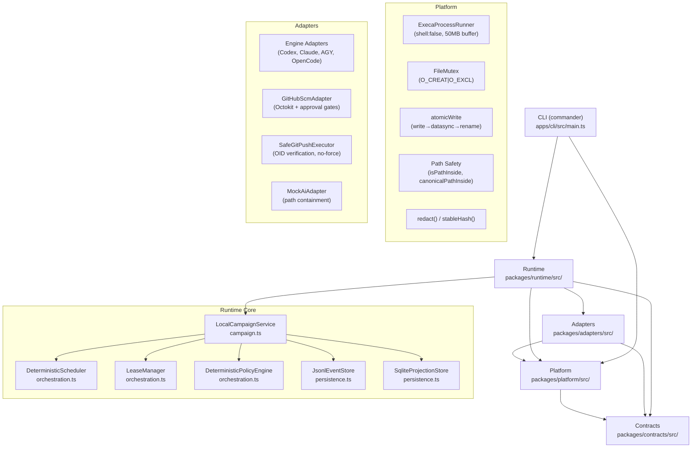
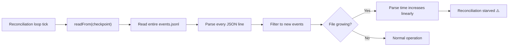
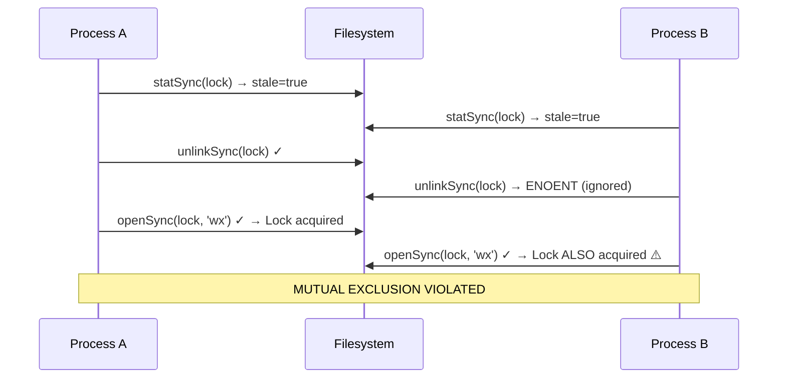
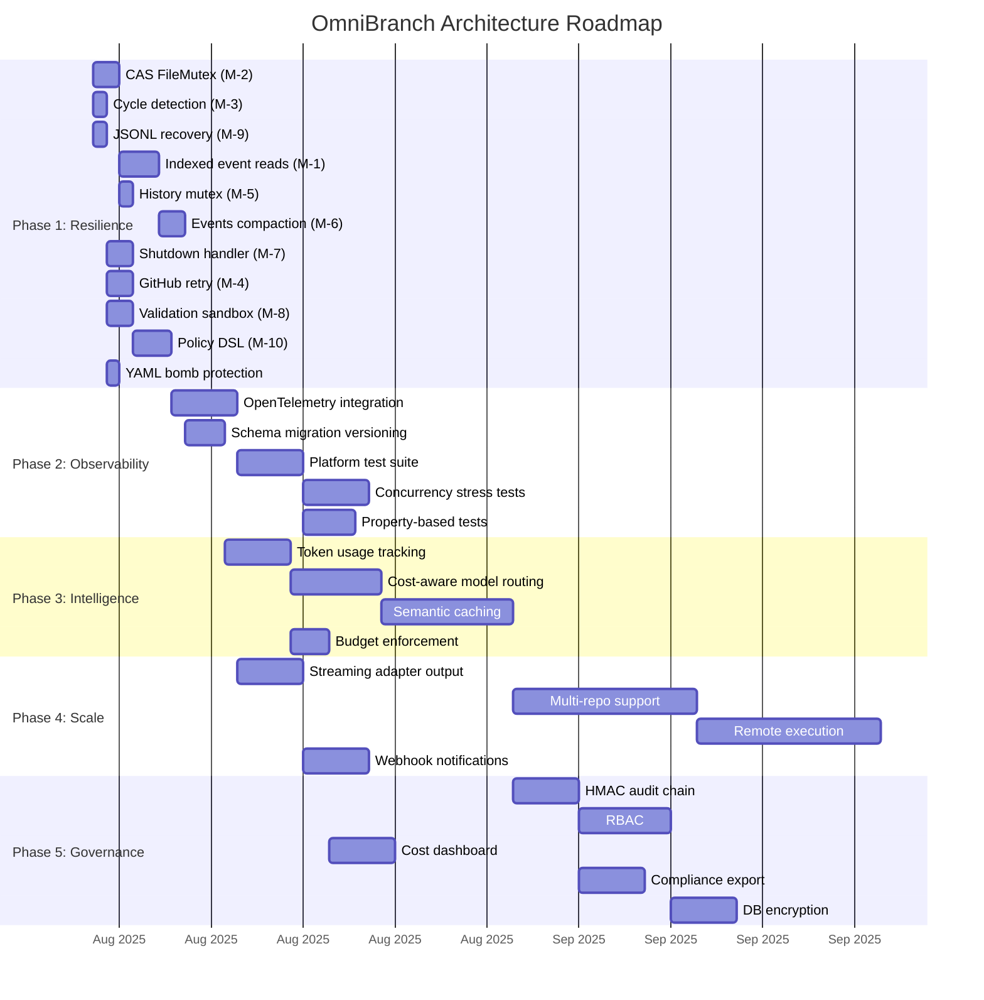

# OmniBranch v0.2.1 — Architectural Analysis Report

> **Codebase:** [OmniBranch](file:///c:/Users/mdasifinit/Documents/Code/OmniBranch) v0.2.1  
> **Stack:** TypeScript 6.0 / Node.js 22+, pnpm monorepo, better-sqlite3 (WAL), execa (`shell: false`), pino, picomatch, ajv (Draft 2020-12), commander  
> **Architecture:** Event-sourced, lease-based deterministic orchestration over Git worktrees with policy-gated execution  

---

## System Architecture Summary



**Key design strengths already present:**
- **Event sourcing** with append-only JSONL ledger + SQLite projections for crash recovery via deterministic replay
- **Lease-based concurrency** with TTL, heartbeat deadlines, and glob-based ownership locks
- **`shell: false` everywhere** in `ExecaProcessRunner` — eliminates shell injection
- **50MB `maxBuffer`** on all process output — prevents OOM from verbose engines
- **Atomic writes** with `datasync` + rename — survives power loss
- **`FileMutex`** on campaign lock and git lock — serializes concurrent access
- **Policy engine** with `require_approval` default — blocks mutations without explicit approval
- **`SafeGitPushExecutor`** with OID verification — prevents lost updates
- **Deterministic backoff** with stable hash jitter — prevents thundering herd
- **Preflight checks** run before every campaign — catches environment issues early
- **NUL byte validation** in process runner — blocks argument injection
- **Secret redaction** in event logs — prevents credential leakage
- **`dryRunDefault: true`** — new users can't accidentally trigger API calls

---

## 1. Edge Case Analysis

### 1.1 Concurrency & State Race Conditions

#### EC-1: FileMutex TOCTOU on Stale Lock Recovery
**Location:** [index.ts](file:///c:/Users/mdasifinit/Documents/Code/OmniBranch/packages/platform/src/index.ts) — `FileMutex.acquire()`  
**Trigger:** Two processes simultaneously detect a stale lock (mtime > `staleAfterMs`). Process A calls `unlinkSync`. Between A's unlink and A's next `openSync('wx')`, Process B also calls `unlinkSync` (succeeds since A already removed it) and then `openSync('wx')` — acquiring the lock. Process A's `openSync('wx')` then also succeeds (the lock was briefly absent), giving **both processes the lock simultaneously**.  
**Impact:** Mutual exclusion violation. Two campaign runs could modify the same event store concurrently, corrupting the JSONL ledger. The window is microseconds wide but becomes material under high contention (CI environments with rapid campaign launches).  
**Probability:** Low in single-user setups; non-trivial in CI/CD pipelines with parallel jobs.

#### EC-2: JsonlEventStore Linear Scan Degradation
**Location:** [persistence.ts](file:///c:/Users/mdasifinit/Documents/Code/OmniBranch/packages/runtime/src/persistence.ts) — `JsonlEventStore.readFrom()`  
**Trigger:** Campaign with 100+ tasks running 3+ retry attempts each, generating thousands of events.  
**Behavior:** `readFrom(afterSequence)` reads and parses the **entire** `events.jsonl` file on every reconciliation loop iteration (default: every 30 seconds), filtering to events after the checkpoint. As the file grows, parse time increases linearly.  
**Impact:** At ~10,000 events (each ~500 bytes = 5MB file), each reconciliation cycle spends 50-100ms parsing JSON. At 100,000 events, this becomes seconds per cycle. The reconciliation interval of 30s becomes the parse time, starving the scheduler.

#### EC-3: Truncated JSONL Line on Crash
**Location:** [persistence.ts](file:///c:/Users/mdasifinit/Documents/Code/OmniBranch/packages/runtime/src/persistence.ts) — `JsonlEventStore.readAll()`  
**Trigger:** Process killed (`SIGKILL`, OOM killer) between `fs.appendFileSync` and `fs.fdatasyncSync`, or mid-write of a JSON line.  
**Behavior:** The last line of `events.jsonl` is a partial JSON string. On restart, `JSON.parse` throws on that line. The entire `readAll()` call fails, preventing campaign recovery.  
**Impact:** Campaign becomes unrecoverable without manual file editing. All state since the last successful write is lost.

#### EC-4: Documentation/History Read-Modify-Write Race
**Location:** [task-history.ts](file:///c:/Users/mdasifinit/Documents/Code/OmniBranch/packages/runtime/src/task-history.ts), [documentation.ts](file:///c:/Users/mdasifinit/Documents/Code/OmniBranch/packages/runtime/src/documentation.ts)  
**Trigger:** Two concurrent work items complete simultaneously, both calling `TaskHistoryService.append()`.  
**Behavior:** Both read the same `HISTORY.md`, both append their entry, both call `atomicWrite`. The last rename wins — the first item's history entry is silently lost. While the primary state (event store + projections) is safe, the human-readable audit trail becomes incomplete.  
**Impact:** Missing entries in Markdown-format history. No data loss in the authoritative event store, but operator confusion when reviewing task history.

---

### 1.2 Scheduling & Orchestration Edge Cases

#### EC-5: Dependency Cycle → Permanent Deadlock
**Location:** [orchestration.ts](file:///c:/Users/mdasifinit/Documents/Code/OmniBranch/packages/runtime/src/orchestration.ts) — `DeterministicScheduler.selectReady()`  
**Trigger:** Plan with tasks A→B→A (circular dependency). Schema validation in [config.ts](file:///c:/Users/mdasifinit/Documents/Code/OmniBranch/packages/runtime/src/config.ts) checks that `dependsOn` references valid task IDs but does **not** detect cycles.  
**Behavior:** The scheduler's `selectReady` checks if all dependencies have status `succeeded`. In a cycle, no task can become `ready` because each waits for the other. The campaign loop spins indefinitely, sleeping 30s per iteration, never completing.  
**Impact:** Campaign hangs forever. No timeout on the campaign loop itself. Requires manual SIGINT.

#### EC-6: Adapter Probe False Negative
**Location:** [engines.ts](file:///c:/Users/mdasifinit/Documents/Code/OmniBranch/packages/adapters/src/engines.ts) — `probe()`  
**Trigger:** Engine CLI is installed but returns non-zero exit code from `--version` due to missing config file, expired token, or network check on startup.  
**Behavior:** `probe()` reports `{ available: false }`. Preflight check fails with "Engine not available" even though the engine is installed and functional for actual work.  
**Impact:** False failure; user must bypass preflight or debug a misleading error.

#### EC-7: Ownership Glob Over-Matching
**Location:** [orchestration.ts](file:///c:/Users/mdasifinit/Documents/Code/OmniBranch/packages/runtime/src/orchestration.ts) — `LeaseManager.acquire()`  
**Trigger:** Two tasks with ownership paths `src/**` and `src/utils/helper.ts`. The first task acquires a lease on `src/**`. The second task's `src/utils/helper.ts` overlaps with `src/**` via picomatch glob matching.  
**Behavior:** The second task cannot acquire a lease, even if it only modifies `helper.ts` and the first task never touches that file. The glob comparison is purely syntactic — it doesn't consider actual file changes.  
**Impact:** False serialization; parallel tasks that could safely run concurrently are forced to run sequentially. Throughput degradation proportional to overly broad ownership declarations.

#### EC-8: Lease Heartbeat Drift from Clock Skew
**Location:** [orchestration.ts](file:///c:/Users/mdasifinit/Documents/Code/OmniBranch/packages/runtime/src/orchestration.ts) — `LeaseManager.renew()`  
**Trigger:** `SystemClock.now()` uses `Date.now()`, which can jump forward or backward due to NTP synchronization, DST changes, or system sleep/resume.  
**Behavior:** A forward clock jump during sleep could expire all active leases instantly on resume. A backward jump could make leases appear perpetually valid.  
**Impact:** Forward jump: all running tasks are treated as expired, triggering unnecessary requeuing and retry. Backward jump: stale leases are never reclaimed, blocking new work.

---

### 1.3 Input & Configuration Edge Cases

#### EC-9: Policy Rule Shallow Matching Limitations
**Location:** [orchestration.ts](file:///c:/Users/mdasifinit/Documents/Code/OmniBranch/packages/runtime/src/orchestration.ts) — `DeterministicPolicyEngine.evaluate()`  
**Trigger:** Policy rule `{ action: 'write_repo', when: { path: 'src/config.ts' }, decision: 'deny' }`. Action requests include `{ class: 'write_repo', path: 'src/config.ts', content: '...' }`.  
**Behavior:** The `when` matching does shallow equality on each key. It works for exact string matches but cannot express: "deny writes to any path matching `*.config.*`" or "allow git_read for all refs". Users must create one rule per specific case.  
**Impact:** Policy configuration becomes verbose and fragile for broad rules. Users may misconfigure policies, leading to unexpected `require_approval` blocks.

#### EC-10: Untyped Policy Conditions in Schema
**Location:** [workspace-plan.schema.json](file:///c:/Users/mdasifinit/Documents/Code/OmniBranch/schemas/workspace-plan.schema.json) — `policies.rules[].when`  
**Trigger:** User writes `when: { foo: [1, 2, "bar"] }` — an arbitrary object that passes schema validation.  
**Behavior:** Schema defines `when` as `{ type: "object" }` with no property constraints. The policy engine attempts shallow equality matching against an array value, which always fails to match any action. The rule becomes a dead rule.  
**Impact:** Silent misconfiguration. Security-critical deny rules may never activate.

#### EC-11: Command Environment Override
**Location:** [workspace-plan.schema.json](file:///c:/Users/mdasifinit/Documents/Code/OmniBranch/schemas/workspace-plan.schema.json) — `commands.*.env`  
**Trigger:** Validation command configured with `env: { PATH: "/tmp/evil", LD_PRELOAD: "/tmp/libhook.so" }`.  
**Behavior:** Schema allows unrestricted string properties in `env`. `ProcessRunner` merges these with `process.env`. Overriding `PATH` or `LD_PRELOAD` could redirect execution to malicious binaries.  
**Impact:** Privilege escalation if the workspace plan is authored by an untrusted party.

#### EC-12: YAML Alias Expansion Bomb
**Location:** [config.ts](file:///c:/Users/mdasifinit/Documents/Code/OmniBranch/packages/runtime/src/config.ts) — `loadWorkspacePlan()`  
**Trigger:** YAML with exponential anchor expansion:
```yaml
a: &a ["x","x","x","x","x","x","x","x","x","x"]
b: &b [*a,*a,*a,*a,*a,*a,*a,*a,*a,*a]
c: &c [*b,*b,*b,*b,*b,*b,*b,*b,*b,*b]
d: &d [*c,*c,*c,*c,*c,*c,*c,*c,*c,*c]
```
**Behavior:** The `yaml` library expands all aliases in memory. 4 levels of 10x expansion = 10,000 elements. 8 levels = 100 million. No `maxAliasCount` option is set.  
**Impact:** OOM crash before schema validation runs.

---

## 2. Failure Point Mapping

### FP-1: Event Store Read Bottleneck



**Root cause:** `JsonlEventStore.readFrom()` has no index, offset tracking, or seek capability. It always reads from byte 0.  
**Blast radius:** Campaign throughput degrades as events accumulate. At scale (10K+ events), the scheduler cannot keep up with the reconciliation interval, causing tasks to wait longer than necessary for scheduling.

---

### FP-2: FileMutex Stale Lock TOCTOU



**Root cause:** Between stale lock removal and exclusive create, no atomic operation bridges the gap.  
**Blast radius:** Concurrent event store writes corrupt the JSONL ledger. SQLite projection store may also see inconsistent event sequences.

---

### FP-3: Dependency Cycle → Permanent Deadlock

**Root cause:** Cycle detection is absent from `validateWorkspacePlan()` in [config.ts](file:///c:/Users/mdasifinit/Documents/Code/OmniBranch/packages/runtime/src/config.ts). The scheduler never selects items whose dependencies aren't all `succeeded`, and a cycle means no item can ever reach `succeeded`.  
**Blast radius:** Campaign hangs indefinitely. The only recovery is manual process termination. No diagnostic message indicates a cycle.

---

### FP-4: GitHub 429 Rate Limit Without Retry

**Affected file:** [github.ts](file:///c:/Users/mdasifinit/Documents/Code/OmniBranch/packages/adapters/src/github.ts)  
**Root cause:** `normalizeGitHubError` maps HTTP 429 to error code `rate_limited` but the `GitHubScmAdapter` does not retry the request. The error propagates to the campaign service, which may treat it as a permanent failure.  
**Blast radius:** PR creation or merge fails permanently due to a transient rate limit. The task is marked `failed` and consumed a retry attempt unnecessarily.

---

### FP-5: Documentation History Clobber

**Affected files:** [task-history.ts](file:///c:/Users/mdasifinit/Documents/Code/OmniBranch/packages/runtime/src/task-history.ts), [documentation.ts](file:///c:/Users/mdasifinit/Documents/Code/OmniBranch/packages/runtime/src/documentation.ts)  
**Root cause:** These services perform read→transform→atomicWrite without holding the `FileMutex`. Two concurrent completions race.  
**Blast radius:** Lost history entries. The authoritative event store is unaffected, but human-readable artifacts are incomplete.

---

### FP-6: Unbounded `applied_events` Table Growth

**Affected file:** [persistence.ts](file:///c:/Users/mdasifinit/Documents/Code/OmniBranch/packages/runtime/src/persistence.ts) — `SqliteProjectionStore`  
**Root cause:** Every applied event inserts a row into `applied_events` for idempotency checking. No compaction, archival, or pruning.  
**Blast radius:** Over many campaigns on the same repository, the table grows to millions of rows. SQLite query performance for `WHERE sequence NOT IN (SELECT sequence FROM applied_events)` degrades significantly.

---

### FP-7: Adapter Process Orphaning on SIGKILL

**Root cause:** `execa` sends SIGTERM on parent abort and handles SIGINT, but cannot intercept SIGKILL (which the OOM killer uses). Spawned engine CLI processes continue running after the parent dies.  
**Blast radius:** Orphan engine processes consume API credits, hold file locks in worktrees, and potentially continue modifying code without orchestration oversight. The `CampaignCleanupService.reconcile()` cleans up worktrees but cannot kill orphan processes.

---

### FP-8: Validation Command Side Effects

**Affected file:** [campaign.ts](file:///c:/Users/mdasifinit/Documents/Code/OmniBranch/packages/runtime/src/campaign.ts) — validation execution  
**Root cause:** Validation commands run via `ProcessRunner` with `cwd` set to the worktree, but the commands can access the entire filesystem. The policy engine gates `execute_command` actions, but if the policy allows validation commands (which it typically must), those commands can write files outside the worktree, make network requests, or read sensitive environment variables.  
**Blast radius:** Data exfiltration or filesystem corruption from malicious or buggy validation scripts.

---

## 3. Mitigation Implementation

### M-1: Indexed Event Store with Byte-Offset Seeks

**Targets:** FP-1 (O(n) read bottleneck), EC-2 (scan degradation)

```typescript
// packages/runtime/src/persistence.ts — MODIFIED JsonlEventStore

interface EventStoreCheckpoint {
  lastSequence: number;
  byteOffset: number;   // Byte position of last-read event's end
}

class JsonlEventStore {
  private checkpoint: EventStoreCheckpoint = { lastSequence: 0, byteOffset: 0 };

  readFrom(afterSequence: number): EventEnvelope[] {
    const fd = fs.openSync(this.filePath, 'r');
    try {
      const stat = fs.fstatSync(fd);
      if (stat.size === this.checkpoint.byteOffset && afterSequence >= this.checkpoint.lastSequence) {
        return []; // No new data — fast path
      }

      // Seek to last known position if checkpoint matches requested sequence
      const startOffset = afterSequence >= this.checkpoint.lastSequence
        ? this.checkpoint.byteOffset
        : 0; // Full read needed if requesting earlier events

      const buffer = Buffer.alloc(stat.size - startOffset);
      fs.readSync(fd, buffer, 0, buffer.length, startOffset);

      const lines = buffer.toString('utf-8').split('\n').filter(l => l.trim());
      const events: EventEnvelope[] = [];

      for (const line of lines) {
        try {
          const event = JSON.parse(line) as EventEnvelope;
          if (event.sequence > afterSequence) {
            events.push(event);
          }
        } catch {
          // Truncated line — skip (see M-9 for recovery)
          continue;
        }
      }

      // Update checkpoint
      if (events.length > 0) {
        this.checkpoint = {
          lastSequence: events[events.length - 1].sequence,
          byteOffset: stat.size,
        };
      }

      return events;
    } finally {
      fs.closeSync(fd);
    }
  }
}
```

**Complexity reduction:** From O(n) per poll to O(Δn) where Δn is new events since last read. The fast path (no new data) is O(1).

---

### M-2: Compare-and-Swap FileMutex

**Targets:** FP-2 (TOCTOU race), EC-1 (stale lock race)

```typescript
// packages/platform/src/index.ts — MODIFIED FileMutex.acquire()

async acquire(timeoutMs: number = 120_000): Promise<void> {
  const deadline = Date.now() + timeoutMs;

  while (Date.now() < deadline) {
    try {
      // Atomic exclusive create
      const fd = fs.openSync(this.lockPath, 'wx');
      const lockInfo = JSON.stringify({
        owner: process.pid,
        timestamp: new Date().toISOString(),
        nonce: crypto.randomUUID(),  // Unique per acquisition
      });
      fs.writeSync(fd, lockInfo);
      fs.closeSync(fd);
      this._nonce = JSON.parse(lockInfo).nonce;
      return;
    } catch (e) {
      if ((e as any).code === 'EEXIST') {
        const staleMs = this.options.staleAfterMs ?? 60_000;

        try {
          // Read lock content + check staleness atomically
          const content = fs.readFileSync(this.lockPath, 'utf-8');
          const lock = JSON.parse(content);
          const stat = fs.statSync(this.lockPath);

          if (Date.now() - stat.mtimeMs > staleMs) {
            // Stale lock — use rename-based replacement instead of unlink+create
            const tmpLock = this.lockPath + `.${process.pid}.${Date.now()}`;
            try {
              // Create our own lock file
              const fd2 = fs.openSync(tmpLock, 'wx');
              const newLockInfo = JSON.stringify({
                owner: process.pid,
                timestamp: new Date().toISOString(),
                nonce: crypto.randomUUID(),
                replacedStale: lock.nonce,
              });
              fs.writeSync(fd2, newLockInfo);
              fs.closeSync(fd2);

              // Atomic rename replaces stale lock
              fs.renameSync(tmpLock, this.lockPath);
              this._nonce = JSON.parse(newLockInfo).nonce;
              return;
            } catch {
              // Another process beat us — clean up and retry
              try { fs.unlinkSync(tmpLock); } catch { /* ignore */ }
            }
          }
        } catch {
          // Lock disappeared between checks — retry immediately
          continue;
        }

        await new Promise(r => setTimeout(r, 100 + Math.random() * 100));
        continue;
      }
      throw e;
    }
  }
  throw new Error(`Failed to acquire lock ${this.lockPath} within ${timeoutMs}ms`);
}

release(): void {
  try {
    // Only release if we own the lock (compare nonce)
    const content = fs.readFileSync(this.lockPath, 'utf-8');
    const lock = JSON.parse(content);
    if (lock.nonce === this._nonce) {
      fs.unlinkSync(this.lockPath);
    }
  } catch {
    // Ignore — lock may already be released
  }
}
```

**Key improvement:** Stale lock replacement uses `rename` (atomic on POSIX and Windows NTFS) instead of `unlink` + `create`. Only one process can successfully rename to the lock path. The nonce-based ownership check in `release()` prevents releasing a lock held by another process.

---

### M-3: Dependency Cycle Detection at Config Load Time

**Targets:** FP-3 (permanent deadlock), EC-5 (cycle detection)

```typescript
// packages/runtime/src/config.ts — ADD to validateWorkspacePlan()

function detectDependencyCycles(tasks: TaskSpec[]): string[] | null {
  const taskIds = new Set(tasks.map(t => t.id));
  const adjacency = new Map<string, string[]>();
  const inDegree = new Map<string, number>();

  for (const task of tasks) {
    adjacency.set(task.id, []);
    inDegree.set(task.id, 0);
  }

  for (const task of tasks) {
    for (const dep of task.dependsOn ?? []) {
      adjacency.get(dep)!.push(task.id);
      inDegree.set(task.id, (inDegree.get(task.id) ?? 0) + 1);
    }
  }

  // Kahn's algorithm — topological sort
  const queue = [...inDegree.entries()]
    .filter(([, deg]) => deg === 0)
    .map(([id]) => id);
  const sorted: string[] = [];

  while (queue.length > 0) {
    const current = queue.shift()!;
    sorted.push(current);
    for (const neighbor of adjacency.get(current) ?? []) {
      const newDeg = inDegree.get(neighbor)! - 1;
      inDegree.set(neighbor, newDeg);
      if (newDeg === 0) queue.push(neighbor);
    }
  }

  if (sorted.length < tasks.length) {
    // Cycle detected — identify participating tasks
    const inCycle = tasks
      .filter(t => !sorted.includes(t.id))
      .map(t => t.id);
    return inCycle;
  }

  return null; // No cycles
}

// In validateWorkspacePlan, after existing semantic checks:
const cycle = detectDependencyCycles(plan.tasks);
if (cycle) {
  throw new ConfigValidationError(
    `Dependency cycle detected involving tasks: ${cycle.join(' → ')}. ` +
    `Remove or restructure dependencies to eliminate the cycle.`
  );
}
```

---

### M-4: Retry-Aware GitHub Adapter

**Targets:** FP-4 (429 rate limit)

```typescript
// packages/adapters/src/github.ts — MODIFIED

private async withRetry<T>(
  fn: () => Promise<T>,
  { maxAttempts = 3, context = '' } = {},
): Promise<T> {
  for (let attempt = 1; attempt <= maxAttempts; attempt++) {
    try {
      return await fn();
    } catch (error) {
      const normalized = normalizeGitHubError(error);

      if (normalized.code === 'rate_limited' && attempt < maxAttempts) {
        // Parse Retry-After header if available
        const retryAfter = (error as any)?.response?.headers?.['retry-after'];
        const delayMs = retryAfter
          ? parseInt(retryAfter, 10) * 1000
          : 1000 * Math.pow(2, attempt - 1); // Exponential fallback

        console.warn(
          `[GitHub] Rate limited on ${context}, retry ${attempt}/${maxAttempts} ` +
          `in ${Math.round(delayMs / 1000)}s`
        );
        await new Promise(r => setTimeout(r, delayMs));
        continue;
      }

      if (normalized.code === 'server_error' && attempt < maxAttempts) {
        const delayMs = 2000 * Math.pow(2, attempt - 1);
        console.warn(
          `[GitHub] Server error on ${context}, retry ${attempt}/${maxAttempts} ` +
          `in ${Math.round(delayMs / 1000)}s`
        );
        await new Promise(r => setTimeout(r, delayMs));
        continue;
      }

      throw normalized;
    }
  }
  throw new Error('Unreachable');
}

// Usage in createPullRequest:
async createPullRequest(params: CreatePrParams): Promise<PullRequestResult> {
  // ... validation and approval checks ...
  return this.withRetry(
    () => this.octokit.pulls.create({ /* ... */ }),
    { maxAttempts: 3, context: 'createPullRequest' },
  );
}
```

---

### M-5: Mutex-Guarded Documentation Writes

**Targets:** FP-5 (history clobber), EC-4 (read-modify-write race)

```typescript
// packages/runtime/src/task-history.ts — MODIFIED

class TaskHistoryService {
  constructor(private mutex: FileMutex) {}

  async append(dir: string, entry: TaskHistoryEntry): Promise<void> {
    await this.mutex.acquire(10_000); // 10s timeout for history writes
    try {
      const existing = await this.readUnsafe(dir);
      existing.push(entry);
      const markdown = this.formatMarkdown(existing);
      await atomicWrite(path.join(dir, 'HISTORY.md'), markdown);
    } finally {
      this.mutex.release();
    }
  }
}
```

Apply the same pattern to `ProjectDocumentationService.generate()` and `MergeGuideService.generate()`.

---

### M-6: Applied Events Compaction

**Targets:** FP-6 (unbounded table growth)

```typescript
// packages/runtime/src/persistence.ts — ADD to SqliteProjectionStore

compact(retainAfterSequence: number): { deleted: number } {
  const result = this.db.prepare(`
    DELETE FROM applied_events
    WHERE sequence < ?
  `).run(retainAfterSequence);

  // Update checkpoint metadata
  this.db.prepare(`
    INSERT OR REPLACE INTO projection_meta (key, value)
    VALUES ('compacted_through', ?)
  `).run(String(retainAfterSequence));

  // Reclaim disk space
  this.db.pragma('incremental_vacuum');

  return { deleted: result.changes };
}
```

Invoke compaction after campaign completion when all events have been projected:

```typescript
// In LocalCampaignService finalization:
if (projections.lastAppliedSequence > 1000) {
  const compacted = projections.compact(projections.lastAppliedSequence - 100);
  ctx.logger.info({ deleted: compacted.deleted }, 'Compacted applied_events table');
}
```

---

### M-7: Process Group Cleanup on Shutdown

**Targets:** FP-7 (orphan adapter processes)

```typescript
// packages/runtime/src/campaign.ts — ADD to LocalCampaignService

private activeChildPids = new Set<number>();

// In the adapter launch section:
const handle = adapter.launch(item, worktreePath);
if (handle.processId) {
  this.activeChildPids.add(handle.processId);
}

// In collection:
if (handle.processId) {
  this.activeChildPids.delete(handle.processId);
}

// Register shutdown handler:
private registerShutdownHandler(): void {
  const cleanup = async (signal: string) => {
    this.logger.warn(`Received ${signal}, terminating ${this.activeChildPids.size} child processes`);

    for (const pid of this.activeChildPids) {
      try {
        process.kill(pid, 'SIGTERM');
      } catch {
        // Process may already be dead
      }
    }

    // Give children 5s to exit gracefully
    await new Promise(r => setTimeout(r, 5000));

    // Force kill survivors
    for (const pid of this.activeChildPids) {
      try {
        process.kill(pid, 'SIGKILL');
      } catch { /* ignore */ }
    }

    // Release locks
    this.campaignMutex.release();
    this.gitMutex.release();

    // Close stores
    this.eventStore.close();
    this.projectionStore.close();
  };

  process.on('SIGTERM', () => cleanup('SIGTERM').then(() => process.exit(143)));
  process.on('SIGINT', () => cleanup('SIGINT').then(() => process.exit(130)));
}
```

> [!NOTE]
> This cannot intercept SIGKILL. For complete orphan protection, persist child PIDs to disk and have `CampaignCleanupService.reconcile()` terminate them on next startup.

---

### M-8: Validation Command Sandboxing

**Targets:** FP-8 (validation side effects), EC-11 (env override)

```typescript
// packages/runtime/src/campaign.ts — MODIFIED validation execution

const STRIPPED_ENV_VARS = new Set([
  'ANTHROPIC_API_KEY', 'OPENAI_API_KEY', 'GITHUB_TOKEN',
  'AWS_SECRET_ACCESS_KEY', 'GOOGLE_APPLICATION_CREDENTIALS',
  'LD_PRELOAD', 'LD_LIBRARY_PATH', 'DYLD_INSERT_LIBRARIES',
]);

const BLOCKED_ENV_OVERRIDES = new Set([
  'PATH', 'HOME', 'USER', 'SHELL',
  'LD_PRELOAD', 'LD_LIBRARY_PATH', 'DYLD_INSERT_LIBRARIES',
]);

function buildValidationEnv(
  commandEnv: Record<string, string> | undefined,
): Record<string, string> {
  const env = { ...process.env };

  // Strip sensitive vars
  for (const key of STRIPPED_ENV_VARS) {
    delete env[key];
  }

  // Apply command env, blocking dangerous overrides
  if (commandEnv) {
    for (const [key, value] of Object.entries(commandEnv)) {
      if (BLOCKED_ENV_OVERRIDES.has(key)) {
        throw new ConfigValidationError(
          `Validation command cannot override environment variable: ${key}`
        );
      }
      env[key] = value;
    }
  }

  return env;
}

// Validate that command output stays in worktree:
async function runValidation(
  item: WorkItemProjection,
  worktreePath: string,
  commands: CommandSpec[],
  runner: ProcessRunner,
): Promise<boolean> {
  for (const cmd of commands) {
    const command = process.platform === 'win32'
      ? cmd.run.windows ?? cmd.run.posix
      : cmd.run.posix;

    const result = await runner.run(
      process.platform === 'win32' ? 'powershell' : 'bash',
      process.platform === 'win32'
        ? ['-NoProfile', '-NonInteractive', '-Command', command]
        : ['-c', command],
      {
        cwd: worktreePath,  // Constrain working directory
        timeoutMs: cmd.timeoutMs ?? 60_000,
        env: buildValidationEnv(cmd.env),
      },
    );

    if (result.exitCode !== 0) return false;
  }
  return true;
}
```

---

### M-9: Truncated JSONL Line Recovery

**Targets:** EC-3 (crash during event write)

```typescript
// packages/runtime/src/persistence.ts — MODIFIED readAll()

readAll(): EventEnvelope[] {
  const content = fs.readFileSync(this.filePath, 'utf-8');
  const lines = content.split('\n');
  const events: EventEnvelope[] = [];
  let corruptedLines = 0;

  for (let i = 0; i < lines.length; i++) {
    const line = lines[i].trim();
    if (!line) continue;

    try {
      events.push(JSON.parse(line) as EventEnvelope);
    } catch {
      corruptedLines++;
      if (i === lines.length - 1 || (i === lines.length - 2 && !lines[lines.length - 1].trim())) {
        // Last line is truncated — expected crash recovery scenario
        // Write a repaired file without the truncated line
        const repairedContent = events.map(e => JSON.stringify(e)).join('\n') + '\n';
        const backupPath = this.filePath + `.corrupt.${Date.now()}`;
        fs.copyFileSync(this.filePath, backupPath);
        fs.writeFileSync(this.filePath, repairedContent);
        // Log warning about lost event
        console.warn(
          `[EventStore] Recovered from truncated line at position ${i}. ` +
          `Original file backed up to ${backupPath}`
        );
      } else {
        // Corruption in the middle of the file — more serious
        throw new EventStoreError(
          `Corrupted event at line ${i + 1} (not the last line). ` +
          `Manual repair required. File: ${this.filePath}`
        );
      }
    }
  }

  return events;
}
```

---

### M-10: Policy Condition DSL with Glob Matching

**Targets:** EC-9 (shallow matching), EC-10 (untyped conditions)

```typescript
// packages/runtime/src/orchestration.ts — MODIFIED DeterministicPolicyEngine

evaluate(action: PolicyAction): PolicyDecision {
  for (const rule of this.config.policies.rules) {
    if (this.matchesCondition(action, rule.when)) {
      return { decision: rule.decision, reason: rule.reason };
    }
  }
  return { decision: this.config.policies.defaultAction };
}

private matchesCondition(
  action: PolicyAction,
  when: Record<string, unknown>,
): boolean {
  for (const [key, pattern] of Object.entries(when)) {
    const value = (action as Record<string, unknown>)[key];
    if (value === undefined) return false;

    if (typeof pattern === 'string' && typeof value === 'string') {
      // Support glob patterns for string values
      if (pattern.includes('*') || pattern.includes('?')) {
        if (!picomatch(pattern)(value)) return false;
      } else {
        if (pattern !== value) return false;
      }
    } else if (Array.isArray(pattern)) {
      // Pattern is an array — value must be in the array
      if (!pattern.includes(value)) return false;
    } else {
      // Strict equality for non-string types
      if (pattern !== value) return false;
    }
  }
  return true;
}
```

This enables policy rules like:
```yaml
policies:
  rules:
    - action: write_repo
      when: { path: "*.config.*" }   # glob matching
      decision: require_approval
    - action: git_read
      when: { class: ["git_read", "git_write"] }  # array inclusion
      decision: allow
```

---

## 4. Strategic Expansion Plan

### Phase 1: Resilience Hardening (2-3 weeks)

| Item | Priority | Effort | Dependency |
|---|---|---|---|
| M-2: CAS FileMutex | P0 | 2d | None |
| M-3: Cycle detection | P0 | 1d | None |
| M-9: JSONL recovery | P0 | 1d | None |
| M-1: Indexed event reads | P0 | 3d | None |
| M-5: Mutex-guarded history | P1 | 1d | M-2 |
| M-6: Applied events compaction | P1 | 2d | None |
| M-7: Shutdown handler | P1 | 2d | None |
| M-4: GitHub retry | P1 | 2d | None |
| M-8: Validation sandboxing | P1 | 2d | None |
| M-10: Policy DSL | P2 | 3d | None |
| EC-12: YAML alias limit | P2 | 0.5d | None |

**Verification gate:** 
```bash
pnpm test:unit && pnpm test:integration && pnpm test:security
```
Add property-based tests with `fast-check` (already a dependency) for FileMutex contention and scheduler determinism.

---

### Phase 2: Observability Layer (3-4 weeks)

#### 2.1 Structured Telemetry with OpenTelemetry

```typescript
// packages/runtime/src/telemetry.ts — NEW

import { trace, metrics, SpanStatusCode } from '@opentelemetry/api';

const tracer = trace.getTracer('omnibranch', '0.3.0');
const meter = metrics.getMeter('omnibranch');

// Metrics
const taskDuration = meter.createHistogram('omnibranch.task.duration_ms');
const taskAttempts = meter.createCounter('omnibranch.task.attempts');
const leaseAcquisitions = meter.createCounter('omnibranch.lease.acquisitions');
const eventStoreSize = meter.createObservableGauge('omnibranch.events.count');
const activeLeases = meter.createObservableGauge('omnibranch.leases.active');

// Span wrapper for task execution
export async function withTaskSpan<T>(
  taskId: string, taskName: string,
  fn: () => Promise<T>,
): Promise<T> {
  return tracer.startActiveSpan(`task.${taskName}`, async (span) => {
    span.setAttribute('task.id', taskId);
    span.setAttribute('task.name', taskName);
    try {
      const result = await fn();
      span.setStatus({ code: SpanStatusCode.OK });
      return result;
    } catch (error) {
      span.setStatus({ code: SpanStatusCode.ERROR, message: String(error) });
      span.recordException(error as Error);
      throw error;
    } finally {
      span.end();
    }
  });
}
```

#### 2.2 Schema Migration Versioning

```sql
-- Add to SqliteProjectionStore migrations:
CREATE TABLE IF NOT EXISTS schema_migrations (
  version INTEGER PRIMARY KEY,
  applied_at TEXT NOT NULL,
  description TEXT
);
```

```typescript
const MIGRATIONS: Array<{ version: number; description: string; sql: string }> = [
  { version: 1, description: 'Initial schema', sql: INITIAL_SCHEMA },
  { version: 2, description: 'Add token tracking', sql: `
    ALTER TABLE work_items ADD COLUMN token_usage TEXT;
    ALTER TABLE work_items ADD COLUMN cost_usd REAL DEFAULT 0;
  `},
  // Future migrations append here
];

function runMigrations(db: Database): void {
  db.exec(`CREATE TABLE IF NOT EXISTS schema_migrations (
    version INTEGER PRIMARY KEY, applied_at TEXT, description TEXT
  )`);

  const applied = db.prepare('SELECT version FROM schema_migrations')
    .all()
    .map((r: any) => r.version as number);

  for (const migration of MIGRATIONS) {
    if (!applied.includes(migration.version)) {
      db.transaction(() => {
        db.exec(migration.sql);
        db.prepare('INSERT INTO schema_migrations VALUES (?, ?, ?)')
          .run(migration.version, new Date().toISOString(), migration.description);
      })();
    }
  }
}
```

---

### Phase 3: Intelligent Scheduling (4-6 weeks)

#### 3.1 Cost-Aware Model Routing

Extend the scheduler to consider model cost when selecting adapters for tasks:

```typescript
interface ModelProfile {
  name: string;
  costPer1kInputTokens: number;
  costPer1kOutputTokens: number;
  maxContextWindow: number;
  latencyP50Ms: number;
  capabilities: string[];     // ['code-gen', 'refactor', 'analysis', 'test-gen']
}

// Route tasks to cheapest capable model:
function selectModel(task: TaskSpec, models: ModelProfile[]): ModelProfile {
  const taskComplexity = estimateComplexity(task.intent);  // keyword/heuristic classification
  const contextSize = estimateContextSize(task.context);

  return models
    .filter(m => m.maxContextWindow >= contextSize)
    .filter(m => m.capabilities.some(c => matchesTaskType(task, c)))
    .sort((a, b) => a.costPer1kInputTokens - b.costPer1kInputTokens)[0];
}
```

#### 3.2 Semantic Caching

Cache adapter results by task intent hash to skip redundant API calls:

```sql
CREATE TABLE IF NOT EXISTS semantic_cache (
  cache_key TEXT PRIMARY KEY,     -- SHA-256(intent + context_hash + engine)
  engine TEXT NOT NULL,
  result_json TEXT NOT NULL,
  diff_patch TEXT,                -- git diff for replay
  created_at TEXT NOT NULL,
  ttl_seconds INTEGER DEFAULT 86400,
  hit_count INTEGER DEFAULT 0
);
```

Before launching an adapter, check cache:
```typescript
const cacheKey = stableHash(JSON.stringify({
  intent: item.intent,
  contextHash: hashContextFiles(item.context, worktreePath),
  engine: item.lane,
}));

const cached = db.prepare('SELECT * FROM semantic_cache WHERE cache_key = ? AND datetime(created_at, "+" || ttl_seconds || " seconds") > datetime("now")')
  .get(cacheKey);

if (cached) {
  // Replay cached diff
  await applyPatch(worktreePath, cached.diff_patch);
  return JSON.parse(cached.result_json);
}
```

#### 3.3 Token Budget Enforcement

```typescript
interface TokenBudget {
  maxInputTokens?: number;
  maxOutputTokens?: number;
  maxCostUsd?: number;
  warnAtPercent?: number;
}

// In campaign loop, before launching adapter:
const spent = projections.getTotalTokenUsage(ctx.runId);
if (budget.maxCostUsd && spent.costUsd >= budget.maxCostUsd) {
  emit('campaign.budget_exceeded', { spent, budget });
  // Pause campaign, await operator approval to continue
  break;
}
```

---

### Phase 4: Multi-Repo & Remote Execution (6-10 weeks)

| Feature | Description | Key Design Decision |
|---|---|---|
| **Multi-repo orchestration** | Single campaign spanning multiple git repositories | Introduce `RepositoryRef` type; extend `WorkspacePlan.repositories` array; worktrees created per-repo |
| **Remote worktree execution** | Delegate task execution to remote machines via SSH or container orchestration | `RemoteProcessRunner` implementing the `ProcessRunner` interface; rsync worktree contents |
| **Streaming adapter output** | Real-time stdout/stderr from engine adapters | Use `execa`'s streaming API with `buffer: false`; pipe to logger + bounded ring buffer |
| **Webhook notifications** | POST campaign events to external services | `WebhookNotifier` triggered by event store appends; retry with backoff |

---

### Phase 5: Governance & Compliance (4-6 weeks)

| Feature | Description |
|---|---|
| **HMAC audit chain** | Each event envelope includes `hmac = HMAC-SHA256(prev_hmac + event_json, secret)`. Tampering detection via chain verification |
| **RBAC** | Role-based access control for campaign operations. Roles: `viewer`, `operator`, `admin`. Enforce via policy engine extension |
| **Cost dashboard** | CLI `omnibranch cost [--run-id]` aggregates token usage from projection store. Markdown report with per-task breakdown |
| **Compliance export** | Export event store + projections as signed archive for audit purposes. CycloneDX SBOM already exists for supply chain |
| **Database encryption** | SQLite encryption via `sqlcipher` for at-rest protection of sensitive campaign data |

---

### Architecture Roadmap Timeline



---

## Appendix: Test Coverage Gap Matrix

| Module | Unit | Integration | Security | Concurrency | Property | Recommended |
|---|---|---|---|---|---|---|
| **Platform (index.ts)** | ❌ 0 files | ❌ | ❌ | ❌ | ❌ | P0: FileMutex contention, atomicWrite crash, path safety |
| **Runtime orchestration** | ✅ | ✅ | ❌ | ❌ | ❌ | P0: Scheduler determinism (fast-check), lease expiry, backoff |
| **Runtime persistence** | ✅ | ✅ | ❌ | ❌ | ❌ | P1: Event store corruption, projection replay idempotency |
| **Runtime campaign** | ✅ | ✅ | ❌ | ❌ | ❌ | P1: Concurrent campaign rejection, graceful shutdown |
| **Adapters engines** | ✅ | ❌ | ❌ | ❌ | ❌ | P1: Timeout handling, JSON parse fallback |
| **Adapters GitHub** | ✅ (contract) | ❌ | ✅ | ❌ | ❌ | P1: 429 retry, approval gate bypass attempts |
| **CLI** | ⚠️ 1 file | ❌ | ❌ | ❌ | ❌ | P2: Command wiring, error formatting, --json output |
| **Installer** | ✅ | ✅ (contract) | ❌ | ❌ | ❌ | P2: Symlink escape, conflict detection |
