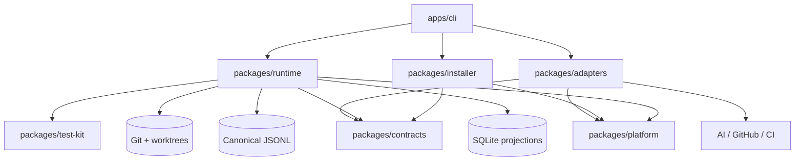

<!-- generated-by: gsd-doc-writer -->

# Architecture

OmniBranch is an event-driven, local-first Node.js control plane for coordinating bounded development work. A strict YAML WorkspacePlan and operator commands enter through the CLI; deterministic services schedule work, enforce policy and ownership, manage Git worktrees, validate results, and write evidence. AI and remote providers are replaceable adapters rather than sources of truth.

## Component map



## Package responsibilities

| Package | Responsibility |
| --- | --- |
| `apps/cli` | Operator commands, stable JSON envelope, composition, and public npm bundle |
| `packages/contracts` | Branded identifiers, lifecycle/status types, ports, evidence records, and installer contracts |
| `packages/platform` | Clock/ID abstractions, process execution, logging, atomic files, locks, paths, and redaction |
| `packages/runtime` | Configuration, events, projections, Git backend, scheduling, ownership, policy, validation, and local campaign service |
| `packages/adapters` | Mock, GitHub, Codex, Claude Code, OpenCode, and Antigravity adapter implementations |
| `packages/installer` | Provider detection, plans, receipts, backups, recovery journals, and contained skill activation |
| `packages/test-kit` | Deterministic fixtures and shared test helpers |

The private packages are bundled into the public `omnibranch` package. Only `better-sqlite3@12.11.1` remains a runtime dependency of the published manifest.

## Campaign data flow

1. `RepositoryDiscovery` resolves the repository root, common Git directory, branch, remotes, and worktrees.
2. `loadWorkspacePlan` parses YAML, applies defaults, validates JSON Schema, performs semantic checks, expands safe templates, and produces a redacted snapshot.
3. `LocalCampaignService` appends versioned events to the canonical JSONL store.
4. Runtime projections materialize campaigns, work items, attempts, leases, locks, approvals, validation, artifacts, and reports in SQLite.
5. The deterministic scheduler selects ready work from the DAG under global, lane, and adapter capacities.
6. Ownership and lease services reject overlapping or stale authority before an adapter is launched.
7. An adapter returns normalized evidence; validation and policy services decide whether the work may advance.
8. Reports are derived from persisted state. Reconciliation can rebuild projections and recover interrupted work.

## Skill installation data flow

1. The CLI locates the canonical bundled skill and resolves `auto`, `all`, or an explicit provider target.
2. `SkillInstaller.plan` validates frontmatter, references, files, hashes, scope support, and path containment without mutating the destination.
3. A mutating command acquires an installer mutex, recovers any prior journal, and recalculates the plan.
4. Files are copied to a sibling staging path, verified again, and atomically renamed into place.
5. Existing managed content is retained under the scope-specific installer state root as a rollback backup.
6. A receipt records every owned file and hash. Update, rollback, and uninstall operate only from verified receipts.

## Key abstractions

| Abstraction | Role | Location |
| --- | --- | --- |
| `EventStore` | Ordered append/read contract for canonical events | `packages/contracts/src/index.ts` |
| `ProjectionStore` | Rebuildable query state contract | `packages/contracts/src/index.ts` |
| `GitBackend` | Typed, containment-aware Git/worktree operations | `packages/contracts/src/index.ts` |
| `Scheduler` | Deterministic ready-work selection | `packages/contracts/src/index.ts` |
| `PolicyEngine` | Deny-first action evaluation and approval evidence | `packages/contracts/src/index.ts` |
| `ValidationRunner` | Typed validation evidence production | `packages/contracts/src/index.ts` |
| `AiEngineAdapter` | Shared engine lifecycle and normalized results | `packages/contracts/src/index.ts` |
| `SkillInstaller` | Receipt-backed universal skill lifecycle | `packages/installer/src/index.ts` |
| `LocalCampaignService` | Offline campaign vertical slice | `packages/runtime/src/service.ts` |

## Deterministic invariants

- Only documented work-item transitions are accepted.
- Ready ordering and retry backoff are reproducible for equivalent inputs.
- JSONL is authoritative; SQLite may be deleted and rebuilt.
- Global and stream event sequences reject duplicates and optimistic-concurrency conflicts.
- Required validation is satisfied only by `pass` unless policy explicitly says otherwise.
- Stale or superseded leases cannot report completion.
- External and destructive actions never gain authority from model output.

## Failure and recovery boundaries

| Failure | Recovery behavior |
| --- | --- |
| Process termination during event/projection work | Replay canonical events and rebuild projections |
| Torn installer activation | Inspect the recovery journal, validate contained paths, restore or finalize deterministically |
| Stale lease or worker | Expire or supersede only with persisted evidence; reject stale results |
| Orphaned worktree or lock | Reconcile Git/filesystem state before cleanup |
| External ref movement | Fail the expected-ref guard and require reconciliation |
| Missing/unknown engine controls | Downgrade to guided mode |
| Unavailable required validation | Keep the gate unsatisfied |

## Repository layout

```text
apps/                 Public CLI composition
packages/             Private deterministic and adapter packages
schemas/              Versioned WorkspacePlan and installer JSON Schemas
skills/omnibranch/    Canonical Agent Skill and generated provider layouts
distribution/         Claude plugin distribution
fixtures/             Git, adapter, and hostile-repository fixtures
scripts/              Build, security, docs, package, and release tooling
docs/                 User guides, contributor guides, references, and ADRs
artifacts/            Verified package, archives, SBOM, and checksums
```

For normative design details, continue to the [architecture reference](01_ARCHITECTURE.md), [Skill Loop specification](02_SKILL_LOOP_SPEC.md), and [ADRs](adr/README.md).
